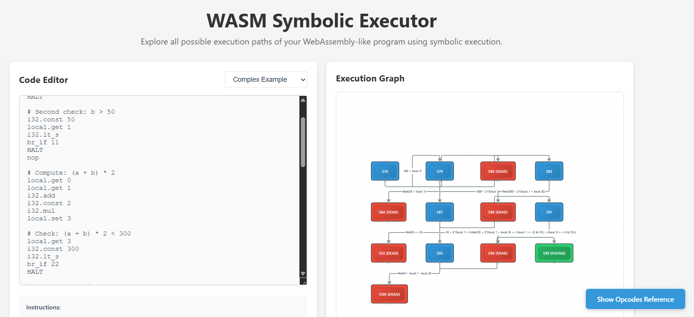
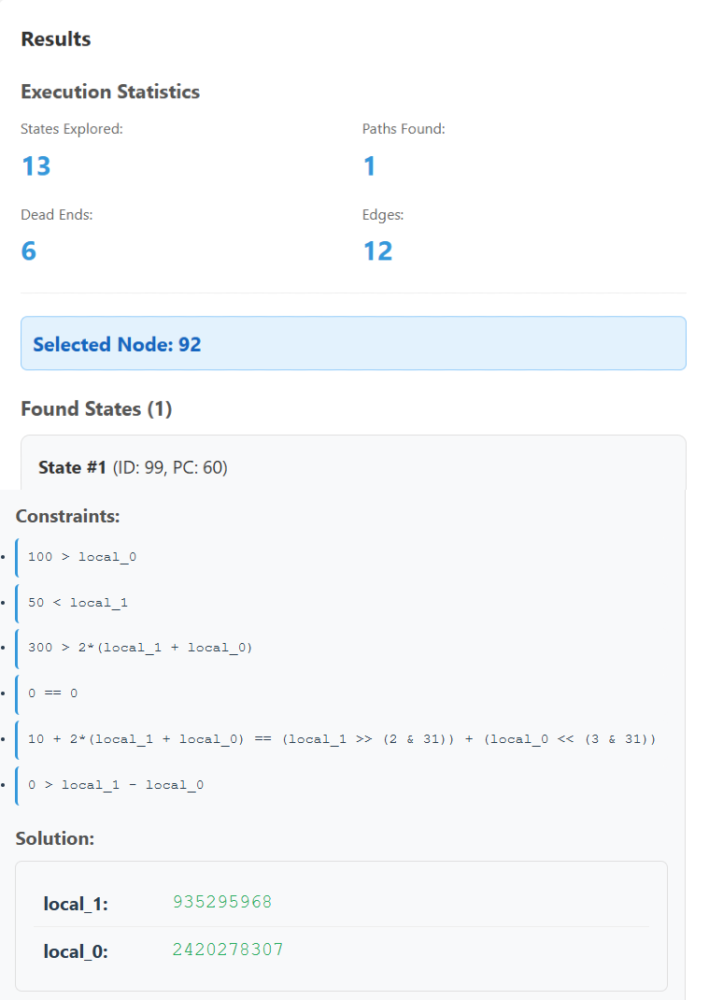

# WASM Symbolic Executor

A symbolic executor for WebAssembly-like programs. Instead of running code with specific inputs, it treats inputs as variables and explores all possible paths.

## What It Does

When your program has `if (x < 100)`, the executor creates two paths: one where `x < 100` is true, and one where it's false. It uses an SMT solver (Z3) to find actual values that make each path work.

## Screenshots





## Project Structure

```
wasm-sym/
├── backend/         
│   ├── src/          # Core symbolic executor code
│   ├── api.py       
│   ├── parser.py    
│   └── requirements.txt
├── frontend/        
│   ├── src/
│   │   ├── components/
│   │   ├── App.tsx
│   │   └── types.ts
│   └── package.json
└── README.md
```

## Setup and Run

### Backend

1. Navigate to backend directory:
```bash
cd backend
```

2. Install dependencies:
```bash
pip install -r requirements.txt
```

3. Run the FastAPI server:
```bash
python api.py
```

### Frontend

1. Navigate to frontend directory:
```bash
cd frontend
```

2. Install dependencies:
```bash
npm install
```

3. Start the development server:
```bash
npm run dev
```


## Usage

1. Start the backend server (port 8000)
2. Start the frontend dev server
3. Open the frontend URL in your browser

## API Endpoints

- `GET /` - API info
- `GET /examples` - Get example programs
- `POST /execute` - Execute code and get results
  ```json
  {
    "code": "local.get 0\ni32.const 100\ni32.lt_s\nbr_if 4\nHALT\nFOUND",
    "max_steps": 1000
  }
  ```

## Command Line (Original)

You can still run the original command-line version:

```bash
python backend/src/engine.py
```
