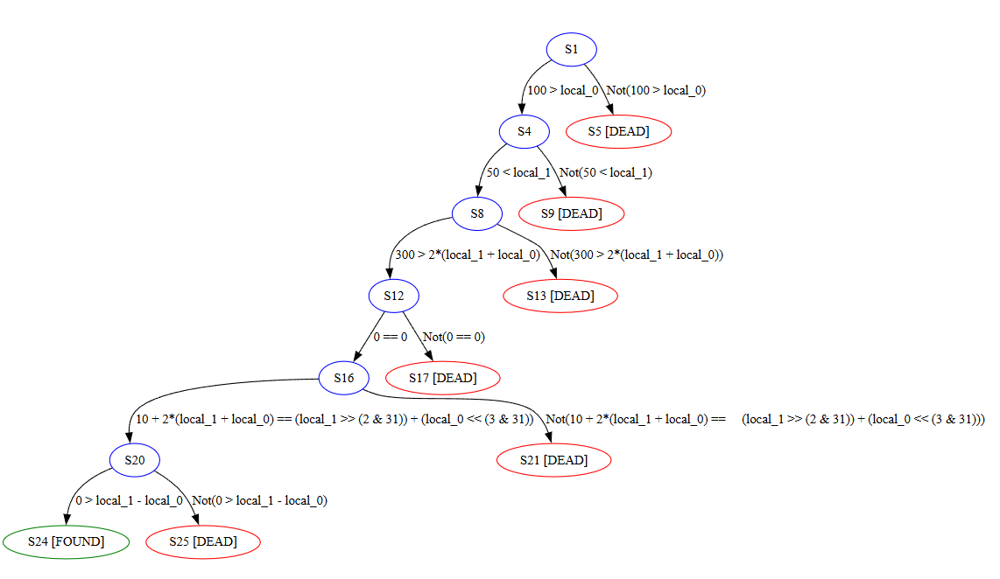

# WASM Symbolic Executor

A symbolic executor for WebAssembly-like programs. Instead of running code with specific inputs, it treats inputs as variables and explores all possible paths.

## What It Does

When your program has `if (x < 100)`, the executor creates two paths: one where `x < 100` is true, and one where it's false. It uses an SMT solver (Z3) to find actual values that make each path work.

## The Example

There's a program in `src/engine.py` that needs to find three inputs (`a`, `b`, `c`) satisfying a bunch of conditions:
- `a < 100` and `b > 50`
- `(a + b) * 2 < 300`
- Some bitwise and memory operations
- A few more checks...

Most paths hit dead ends, but one path reaches the FOUND state.

## The Graph



The graph shows all execution paths:
- **Blue**: States being explored
- **Green**: Found the target! 🎯
- **Red**: Dead ends
- **Edges**: The conditions needed to take that path

## Run It

```bash
python src/engine.py
```

It'll show you which paths work and what input values satisfy the constraints.
